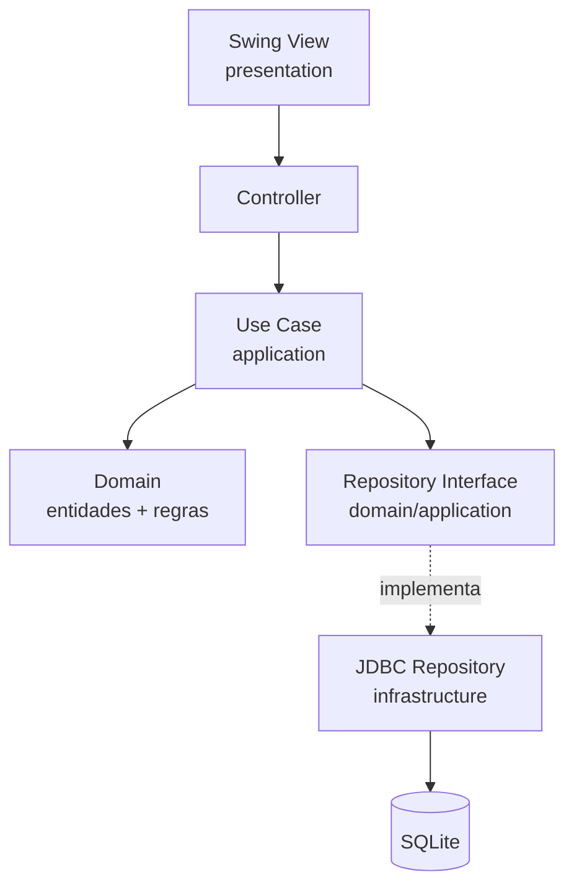

# SisVale Interior

<!-- Badges -->


Sistema desktop para validação e cálculo automatizado do ressarcimento de vale-transporte de servidores que utilizam o transporte público intermunicipal

## Sobre o projeto

O SisVale Interior é um programa desktop para controle e conferência de vale transporte (VT) de servidores que pegam o transporte intermunicipal. Ele substitui a conferência manual de planilhas por um fluxo estruturado: cadastro de servidores, lançamento diário de horários e valores, validação automática das regras e fechamento mensal com totais. O programa será de uso individual, utilizado especialmente pelo técnico responsável pela demanda.

## Problema

- Transcrever manualmente cada dia em uma planilha: data, horário de descida, entrada na unidade, valor da ida, saída, horário do ônibus, valor da volta.
- Conferência manual mês a mês: Consome horas do operador; trabalho repetitivo e cansativo.
- Risco de erro humano: Somas erradas, linhas duplicadas, dias esquecidos, valores trocados.
- Falta de padronização: Cada planilha tem formato próprio; dificulta auditoria e troca de operador.
- Dificuldade em identificar dias/horários inválidos: Sem regra automática, inconsistências passam batido.
- Sem histórico confiável: Comparar meses ou reconstruir o passado depende de arquivos soltos.
- Retrabalho: Erros só aparecem no fechamento, forçando refazer a conferência.

## Solução

### (1) Cadastrar Servidores
  
- Campos: nome, matrícula, CPF, ativo/inativo.
- Matrícula e CPF são únicos, evitando duplicidade.
- Servidores inativos permanecem no histórico, mas não recebem novos lançamentos.

### (2) Lançamento mensal de horários e valores

- Por servidor e por data.
- Campos: hora_descida, hora_entrada, valor_ida, hora_saida, hora_onibus, valor_volta.
- Entrada rápida: formulário único, navegação por teclado, formatação DD/MM/YYYY e HH:mm.

### (3) Validação automática com regra de tolerância

- Tolerância configurável (regra.tolerancia.minutos=15 em application.properties).
- Regras previstas:
  - Horários fora de ordem.
  - Diferenças acima da tolerância entre horários correlacionados.
  - Valores zerados, negativos ou fora de faixa plausível.
- Inconsistências são sinalizadas ao operador, não bloqueiam o registro (ele decide).

### (4) Cálculo do total mensal

- Total por servidor: valor_ida + valor_volta no mês.
- Total geral do mês (todos os servidores).
- Filtros por período (dia, mês, intervalo).
- Exportação do resumo (CSV/planilha) para encaminhar ao pagamento

### (5) Diferenciais em relação à planilha

| **Antes (planilha)** | **Depois (SisVale Interior)** |
|----------------------|-------------------------------|
| Sem validação | Validação automática por regra |
| Soma manual | Total calculado em tempo real |
| Sem histórico | Banco local persistente e consultável |
| Formato livre | Estrutura fixa, padronizada |
| Erro descoberto no fim | Erro sinalizado no momento do lançamento |

Em resumo: o SisVale troca a conferência manual por um fluxo com validação imediata.

## Regras de negócio

### Regra de tolerância de 15 minutos

para cada dia trabalhado, são validados dois pares de horários:

- **ida:** descida do ônibus -> entrada na unidade
- **volta:** saída da unidade -> entrada no ônibus

A tolerância de 15 minutos aplica-se **apenas para horários anteriores** ao ponto de referência.
Horários posteriores são sempre considerados válidos (atrasos, trânsito, ônibus perdido...).

#### Ida - referência: descida do ônibus

| Descida | Entrada | Resultado | Motivo |
|---------|---------|-----------|--------|
|  07:45  |  07:30  | ✅ Válido  | 15 min antes (limite) |
|  07:45  |  07:29  | ❌ Inválido | 16 min antes |
|  07:45  |  08:00  | ✅ Válido  | Depois (sem limite) |

#### Volta - referência: saída da unidade

|  Saída  |  ônibus | Resultado | Motivo |
|---------|---------|-----------|--------|
|  17:00  |  16:45  | ✅ Válido  | 15 min antes (limite) |
|  17:00  |  16:30  | ❌ Inválido | 30 min antes |
|  17:00  |  17:30  | ✅ Válido  | Depois (sem limite) |

#### Cálculo diário

- Ambos pares válidos -> soma dos dois valores
- Apenas um válido -> considera apenas o válido
- Nenhum válido -> dia excluído do cálculo, mas reportado como inválido

## Stack técnica

| Camada | Tecnologia |
|--------|------------|
| Linguagem | `Java 21` |
| Build | `Maven` |
| UI | `Swing` + `FlatLaf` |
| Banco | `SQLite` |
| Persistência | `JDBC` |
| Testes | `JUnit 5` + `AssertJ` |
| Log | `SLF4J` + `Logback` |

## Arquitetura



O projeto segue os princípios da Clean Architecture: o domínio não conhece UI nem banco. As dependências apontam sempre de fora para dentro (infra -> application -> domain).

| Camada | Responsabilidade | Depende de quem? |
|--------|------------------|------------------|
| `domain` | Entidades, values objects, regras puras | `Ninguém` |
| `application` | Casos de uso, orquestração | `domain` |
| `infrastructure` | JDBC, SQLite, configuração, logging | `application` + `domain` |
| `presentation` | Swing, controllers, view models | `application` |

## Como rodar

### Pré-requisitos

- JDK 21+
- Maven 3.9+

```bash
java -version   # deve mostrar 21 ou superior

mvn -version    # deve mostrar 3.9 ou superior
```

### Passos

```bash
# 1. Clonar
git clone https://github.com/SEU_USUARIO/sisvale-interior.git

cd sisvale-interior

# 2. Compilar
mvn clean install

# 3. Rodar
mvn exec:java

# ou gerar o jar executável
mvn clean package 

java -jar target/sisvale-interior-0.1.0-SNAPSHOT.jar
```

Windows/PowerShell: se preferir o caminho do Maven, use **mvn compile exec:java** (sem **-D**), o **mainClass** está fixado no pom.xml. O comando **`mvn exec:java "-Dexec.mainClass=..."`** também funciona, mas exige aspas por causa do parser do PowerShell.

## Estrutura de pastas

```
sisvale-interior/
├── database/              Scripts SQL e banco local (não versionado)
│   └── schema.sql
├── docs/                  Documentação do projeto
│   └── visao.md
├── logs/                  Logs da aplicação (não versionado)
├── src/
│   ├── main/
│   │   ├── java/
│   │   │   └── dev/douglaslira/sisvaleinterior/
│   │   │       ├── domain/          Entidades e regras
│   │   │       ├── application/     Casos de uso
│   │   │       ├── infrastructure/  JDBC, config, logging
│   │   │       ├── presentation/    Swing (views, controllers)
│   │   │       └── Main.java
│   │   └── resources/
│   │       ├── application.properties
│   │       ├── logback.xml
│   │       └── db/schema.sql
│   └── test/
│       └── java/                    Testes unitários e de integração
├── .gitignore
├── LICENSE
├── pom.xml
└── README.md
```

## Roadmap

Checklist do que está feito e do que há por vir:

- [x] Bloco 1 - Estrutura base do repositório
- [ ] Bloco 2 - Domínio puro + testes unitários
- [ ] Bloco 3 - Persistência JDBC + SQLite
- [ ] Bloco 4 - Casos de uso (application)
- [ ] Bloco 5 - Interface Swing
- [ ] Bloco 6 - Empacotamento (jpackage)
- [ ] Fase 2 - IA (detecção de anomalias, OCR)

## Contribuindo

Projeto de **uso individual.** Sugestões e feedbacks são bem-vindos via issues.

## Licença

Este projeto está sob a licença MIT. Veja o arquivo [LICENSE](LICENSE) para mais detalhes.

## Autor

**Douglas Lira**

- Github: [@DouglasLira-Dev](https://github.com/DouglasLira-Dev)
- Linkedin: [dev-douglas-lira](https://www.linkedin.com/in/dev-douglas-lira/)